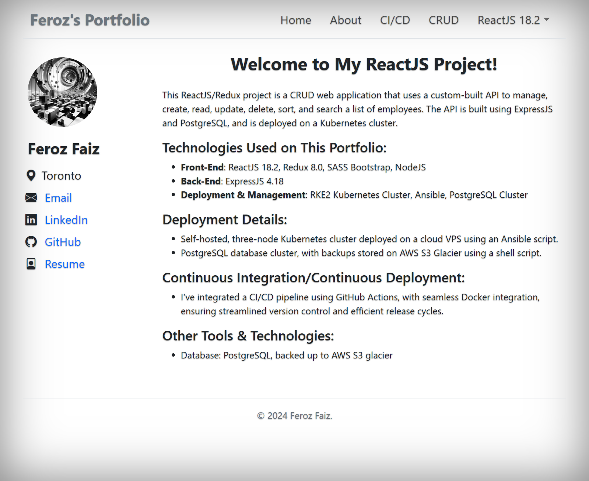
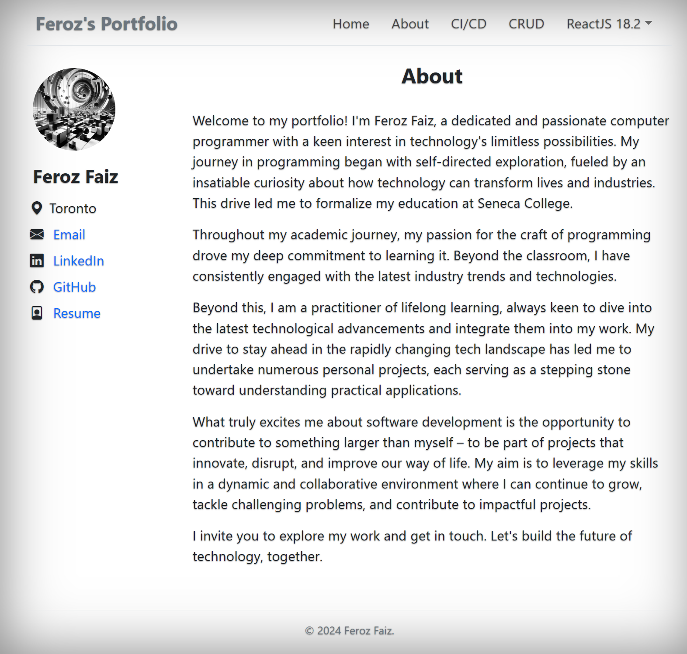
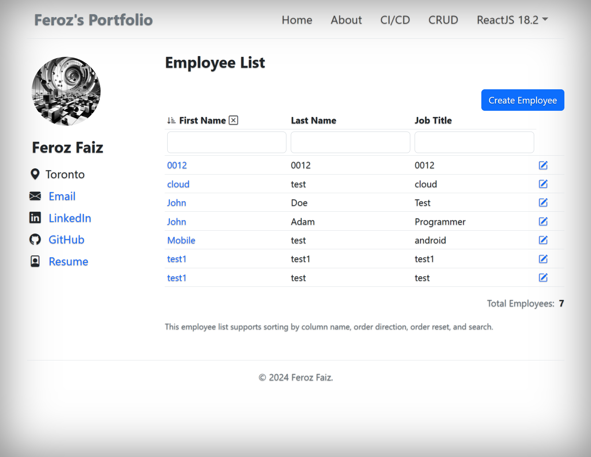
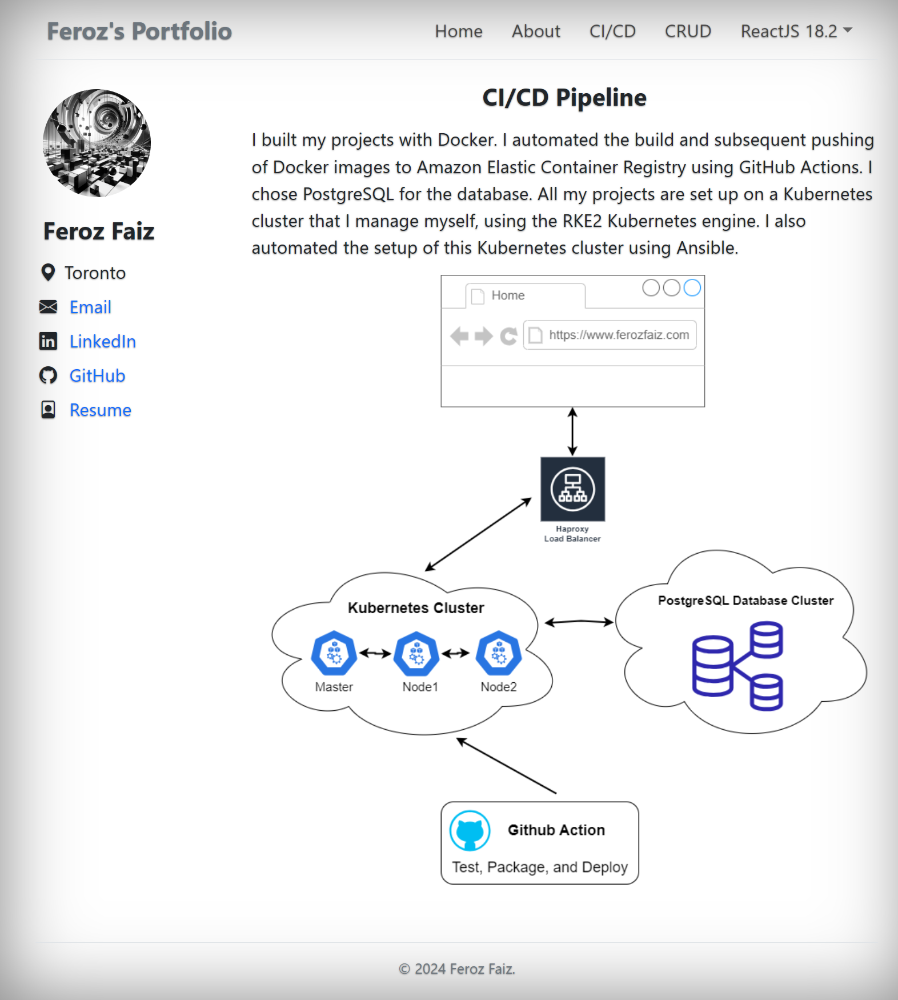

## About the project

This website was built using ReactJS and Redux. It features 'About', 'CI/CD', and 'Employee CRUD' sections. For the backend API, ExpressJS was utilized.

Live Demo: <a href='https://reactjs.ferozfaiz.com/'>reactjs.ferozfaiz.com</a>

### Tech Stack:

- ReactJS
- Redux
- Sass / Scss
- Bootstrap
- PostgreSQL
- Kubernetes
- Docker
- AWS ECR
- ExpressJS for API

## Screenshots

 
<h3 align='center'>Home Page</h3>

 
<h3 align='center'>About</h3>

 
<h3 align='center'>Employee CRUD</h3>

 
<h3 align='center'>CI/CD</h3>

